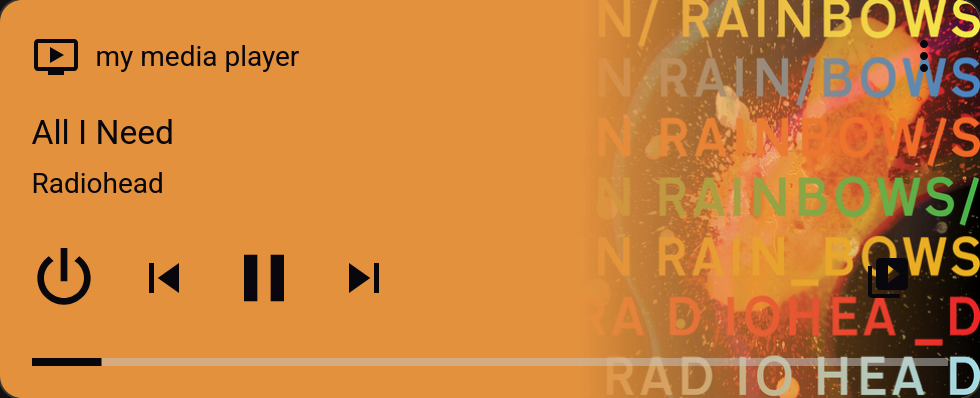

# wled-album-sync

this is a simple standalone script that turns your wled lights into a visualizer that matches the album cover of the currently playing song. only spotify and home assistant media players are supported at the moment.

## setup

only env that is always required is `WLED_URL`, and both or at least one set of `SPOTIFY_*` or `HA_*` depending on which service you want to use.

see [.env.example](../.env.example) for reference

### spotify

create an app at https://developer.spotify.com/dashboard

set the redirect uri to exactly `http://127.0.0.1:8888/callback`

note client id and secret

now you have `SPOTIFY_CLIENT_ID`, `SPOTIFY_CLIENT_SECRET` and `SPOTIFY_REDIRECT_URI`

you need to have the 3 above set in your env to run the script to get the refresh token

to get `SPOTIFY_REFRESH_TOKEN` run [get-refresh-token.sh](../get-refresh-token.sh). running the script will open a browser window you to auth into your spotify account, after that you will be redirected to a page that won't load, all you need is to copy the full url of it and paste it back into the terminal.

if you have nix installed you can run:

```bash
nix run github:xhos/wled-album-sync#get-refresh-token
```

## home assistant

this thing should work with any media player supported by home assistant that provides album covers:



`HA_TOKEN` is a long-lived access token from https://my.home-assistant.io/redirect/profile_security
`HA_URL` is the base url of your home assistant instance
`HA_ENTITY` is the entity id of your media player. get it at https://my.home-assistant.io/redirect/entities. make sure you enable the `Entity ID` column in the table on the top right.

## usage

### direct

```bash
uv run wled-album-sync.py
```

### nixos module

```nix
{
  inputs.wled-album-sync.url = "github:xhos/wled-album-sync";

  outputs = { nixpkgs, wled-album-sync, ... }: {
    nixosConfigurations.yourhost = nixpkgs.lib.nixosSystem {
      modules = [
        wled-album-sync.nixosModules.default
        {
          services.wled-album-sync = {
            enable = true;
            envFile = /run/secrets/wled-album-sync.env;
          };
        }
      ];
    };
  };
}
```

## contributions

feel free to open issues or PRs if you have ideas for improvements or find bugs
